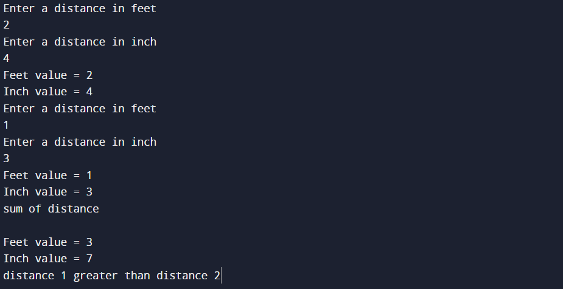

## Question 10
❔ 

### Program

```cpp
#include <iostream>

class Complex{
private:
    float a, b;

public:
    Complex() = default;

    friend std::ostream &operator<<(std::ostream &out, Complex &p) {
        return out << p.a << "i + " << p.b;
    }

    friend std::istream &operator>>(std::istream &is, Complex &p) {
        return is >> p.a >> p.b;
    }
};

int main()
{
    Complex c{};

    std::cout << "Enter the complex coefficients : ";
    std::cin >> c;

    std::cout << "The complex number is "<< c;

    return 0;
}
```

### Algorithm

```markdown
```

### Output

```text

```


## Question 11
❔ 

### Program

```cpp
#include <iostream>

struct Point {
    int x;
    int y;
};

inline double distance(Point a, Point b, Point c) {
    int abx = a.x - b.x;
    int aby = a.y - b.y;
    int acx = a.x - c.x;
    int acy = a.y - c.y;
    int bcx = b.x - c.x;
    int bcy = b.y - c.y;

    return std::min(std::min(sqrt(abx * abx + aby * aby), sqrt(acx * acx + acy * acy)), sqrt(bcx * bcx + bcy * bcy));
}

int main()
{
    Point a{},b{},c{};

    std::cout << "Enter the vertices of the triangle." << std::endl;
    std::cin >> a.x >> a.y;
    std::cin >> b.x >> b.y;
    std::cin >> c.x >> c.y;

    std::cout << "Minimum distance = " << distance(a,b,c);
}
```

### Algorithm

```markdown
```

### Output

```text

```


